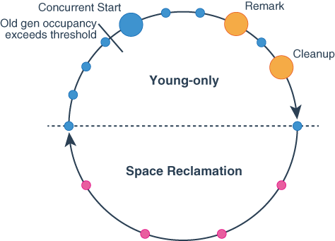

# note

## jvm

- gc
  - 分代收集理论：
    - 弱分代假说：大部分对象是朝生暮死
    - 强分代假说：熬过gc次数越多的的对象越难消亡
    - 跨代引用假说：跨代引用相较于同代引用占比极低
  - 垃圾收集算法：引用计数、可达性分析
  - 垃圾收集策略：
    - 标记清除
      - 内存空间碎片化严重，需要额外的内存分配器，访问器，譬如“分区空闲分配链表”来保证内存空间逻辑上的连续性，相当于硬盘分区表
      - 有更低的*延迟*，因为不会出现*STW*，CMS收集器即使用该策略
    - 标记复制
      - 可能出现 survivor 区内存空间不够存放存活对象，因此出现了分配担保（handle promotion）策略，由老年代来保证存活对象不会丢失
    - 标记整理
      - 整理移动老年代对象可能出现 *stop the world*
      - 有更高的*吞吐量*，因为内存分配、访问频率远高于 gc 频率，会严重影响吞吐量，Parallel Scavenge收集器使用该策略
  - 新生代（young）
    - 使用 *标记复制* 进行回收
    - 垃圾回收称为 young gc / minor gc
    - 分为 eden 区 和 survivor1 和 survivor2， 默认比例为：8-1-1
  - 老年代（old）
    - 使用 *标记整理* 进行回收
    - 垃圾回收称为 major gc
  - 可达性分析
    - GC Root 枚举
      - 方法栈变量
      - 类静态常量
    - 安全点、安全区域
      - 需要指令具有“长时间执行”的特征，比如指令复用，出现在方法调用，循环跳转，异常跳转等场景
      - 通过设置内存页不可用，使得线程test时产生自陷异常信号，然后在预先注册的异常处理器来挂起线程
      - 线程检测到 gc 完成 *根节点枚举* 才离开安全区
    - 跨代引用
      - 记忆集：remember set，有字精度、对象精度、卡表精度（一片内存区域）等粒度
      - 卡表： *记忆集* 的一种实现，实际为字节数组
      - 卡页：对应一个内存块，大小为 2 的 N 次幂，只要某个卡页有跨代引用即标记为 1，需要加入 gc root 扫描
      - 写屏障：类似于AOP的环绕通知，在发生引用关系变化时，若出现了跨代引用，则标记卡页
        - 伪共享问题：需要标记为脏的卡页，恰好位于同一缓存行，导致性能下降。解决方式：添加判断，若卡页已脏则不进行修改，可通过 jvm 参数配置
    - 并发标记
      - 三色标记：黑色为确定存活的对象，灰色为至少访问过一次的对象，白色为尚未访问的对象。
        - 问题：但由于标记过程中用户程序不暂停，引用关系会发生变更，原来的白色对象被黑色对象引用，却没有被标记为黑色，导致对象错误清除
        - 出现条件：
          - 黑色对象产生一个或多个新的引用
          - 灰色对象到白色对象的所有引用路径皆被改变
        - 解决方案：
          - 增量更新：每当黑色对象添加新的引用，将这些引用作为 gc root 进行可达性分析
          - 原始快照：即使灰色对象的引用被更新，也依旧按照快照生成时的引用关系图进行可达性分析
  - CMS (concurrent mark sweeping)
    - 初始标记（阻塞）
    - 并发标记（并发）
    - 重新标记（阻塞）
    - 并发清除（并发）
  - G1 (garbage first)
    - region：将内存划分为2048个 region(大小范围为1M~32M，默认为heapSize/2048)，每个 region 均可承担 eden、survivor、elder等角色，g1进行复制清除时【collection set】中标记的对象copy至【survivor region】或【old region】中，
    【old generation】则只会根据对象年龄将对象copy至对应年龄的 【old region】
    
    - young only phase：仅回收【年轻代】，会逐渐用完所有可用的老年代region
      - 初始标记
      - 并发标记
      - 最终标记
    - space reclaimation phase：会开始增量回收【老年代】空间，同时也会回收【年轻代】，结束后又会流转到【young only phase】
    

## Spring

- bean 生命周期
  - prepare environment
  - 创建 beanFactory
  - refresh
  - 初始化 BeanFactoryPostProcessor 如（ConfigurationClassPostProcessor）
  - AbstractApplicationContext.refresh
  - 扫描 bean：通过 PathMatchingResourcePatternResolver 解析扫描路径里的 Resource
  - 扫描的 bean 信息包装为 BeanDefinition
- 依赖注入自身，避免自调用时切面失效
  - 直接`@Autowired`或`@Resource`自身，并不一定有效，依赖注入进来的 bean 不一定被 `AnnotationAwareAspectJAutoProxyCreator` 代理过，
  （因为被早期引用，被标记为 earlyReferenceBean ，导致再次创建的 bean 被 AnnotationAwareAspectJAutoProxyCreator 忽略）
  没被代理的 bean 不会被 `AutowiredAnnotationBeanPostProcessor` 处理，导致没有进行依赖注入

## SpringMVC

- `@RequestParam`
  - 绑定pojo时可以省略
  - 绑定Map时不可省略
- `@DateTimeFormat(pattern="yyyy-MM-dd")`
  - 必须引入**joda-time**才可以生效
  - 标注在实体的属性上，可以对Date类型进行参数绑定

## mybatis

- update 语句影响行数：jdbc连接参数需要设置`useAffectedRows=true`，并且 xml 里的 sql 一定要使用 update 标签包裹
- 每次执行SQL，mybatis 都会创建一个新的 Executor，Executor 中包含 Transaction，Transaction 中持有 Connection，如果有spring环境，则使用SpringManagedTransaction，会从TransactionManagerSynchronization中获取连接

## Json

- jackson的`@JsonFormat(pattern="yyyy-MM-dd",timezone="GMT+8")`需要加上时区
- long 类型的 json 字段在被js反序列化的时候可能丢失精度，因为js仅支持64位双精度浮点数，1符号位，11指数位，52尾数位，最多有53位表示大整数，因此超过53位的大整数，会丢失精度

## mysql

- 索引
  - 索引失效
    - 不满足最左匹配原则
    - 使用函数
    - 类型转化
      - 显式类型转化：比如 str_to_date()
      - 隐式类型转化：容易被忽视，比如 `shop_id varchar(255) & shopId(Long)` ，导致 `where shop_id = #{shopId}` 时索引失效
- 为何使用 B+ tree 创建索引
  - 每页16k的情况下，
  - 由于非叶子节点均用于存储索引，树高度小，查询效率高
  - 有序，方便从硬盘预加载数据
- 注意 `!=` 条件
  - `A != 1` 该条件不能保留 `A is null` 的情况，需要额外用 `or A is null`来保留
- 注意 `聚合函数` 
  - 使用 `count()`,`sum()`,`min()`等聚合函数作为select子句时，一定要注意即使没查到数据，mysql也会返回 null 值
  - 使用聚合函数时，一定要带上明确的`group by`子句，否则在连接临时表时，可能出现非期望数据
- 注意`left join`
  - 使用左连接查询时，一定要注意连接条件，是否需要移除不匹配数据、是否仅将不需要数据设置为 null
  - 左连接时，在 `on` 之后的筛选条件中，如果仅用右表字段进行筛选，是可以减少符合条件的记录数的，如果仅用左表进行筛选，那么不会减少符合条件的记录数，仅会将不符合条件的记录的右表字段置为 `null`


## maven

- idea使用maven goal
```shell
# 先在顶层pom执行 clean install
clean install -DskipTests --update-snapshots -am --pl contract-client-web
# 再在对应模块pom执行文档生成
smart-doc:html
```

## ai prompt

```shell
# 请参考以下文档描述，生成javabean，它使用包装类型，使用BigDecimal，使用java.util.Date，使用Integer替代Short，使用lombok的@Data注解，实现java.io.Serializable接口，添加文档注释（中文）


# 请参考以下表结构，生成javabean，它使用包装类型，使用BigDecimal，使用java.util.Date，使用Integer替代Short，使用lombok的@Data注解，实现java.io.Serializable接口，添加 mybatis-plus 注解，添加文档注释（中文）


# 请参考以下表结构，生成mybatis的 mapper.java 和 mapper.xml, 其中 mapper.xml 中包含insert、updateByIdSelective、deleteByIdLogically、selectById、selectByCondition 等方法


# 请根据以下表结构，生成三条sql insert测试数据
```