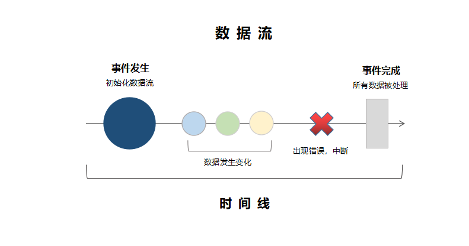
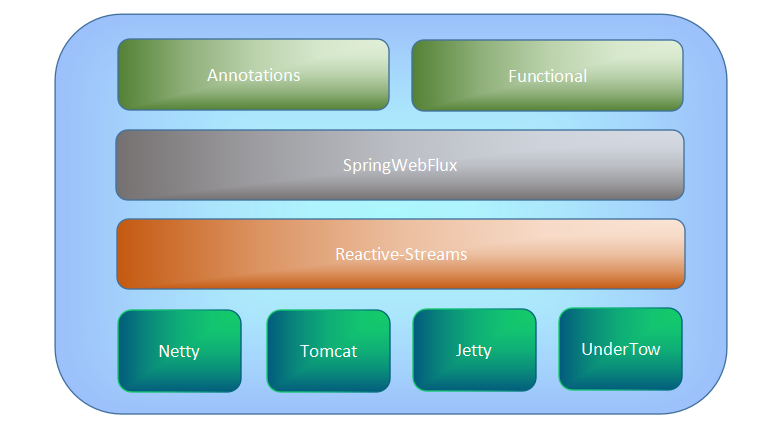

# reactive


## 概念
- Reactive 的宣言是什么？
  - message driven，reactive 系统应该由松耦合的组件构成，并且它们依赖异步的事件驱动
  - responsive，reactive 系统一定要各自响应用户输入
  - resilient，reactive 系统需要将异常隔离在各自系统内部
  - scalable，reactive 系统一定具备可伸缩性，部署多个副本来应对复杂的负载环境

- Reactive Extensions 是什么？
协助构建异步执行、事件驱动的网络交互的类库即为reactive extension，如 ReactiveX

- Reactive Stream specification 的关注点是什么？
- Reactive Stream 是基于什么准则完成的？
- Reactor Framework 最突出的特色是什么？


## 发展历程

- 第一代
- 第二代
- 第三代
- 第四代
- 第五代


## 数据流



## 特性

### 响应式，关注变化，并及时响应
```java
// 普通java代码
int value1 = 5;
int value2 = 10;
int sum = val1 + val2;
System.out.println(sum); // 15
value1 = 15;
System.out.println(sum); // 15

// reactive java 代码
int value1 = 5;
int value2 = 10;
int sum = val1 + val2;
System.out.println(sum); // 15
value1 = 15;
System.out.println(sum); // 25
```
### 柔韧性(resilient)
### 伸缩性(scalable)

### 事件驱动，避免回调地狱
基于发布订阅模型

#### 事件类型
- 订阅者消费
  - Subsription：订阅事件，订阅成功事件
  - Value：值事件，发布者发布的单值事件
  - Completion：流正常结束事件
  - Error：流异常结束事件
- 发布者消费
  - Cancel：取消订阅事件，订阅者取消订阅
  - Request：请求事件，用于主动向发布者拉取数据

```java
// 创建发布者
Flux<Long> fibonacciGenerator = FluxDemo.buildFibonacciGenerator();
// 通过lambda表达式来创建订阅者，消费 Value事件，异常事件，完成事件，订阅事件，返回的 disposable 可用于取消订阅
Disposable disposable = fibonacciGenerator.take(10).subscribe(
    t -> System.out.println("consuming " + t) // Value事件
    , e -> e.printStackTrace() // 异常事件
    , () -> System.out.println("Finished") // 完成事件
    , s -> System.out.println("Subscribed :" + s) // 订阅事件
);
// 订阅者取消订阅，产生取消事件
disposable.dispose();
```


## Reactor

### 构造流，消费流

#### Flux
- flux.just()：最简单的构造流方式
- flux.fromXxx()
  - flux.fromArray()
  - flux.fromIterable()
- flux.create()：fluxSink 可异步生成任意数量的事件，不关注 backpressure ，也不关注订阅关系，即使订阅关系废弃，也能继续生产事件fluxSink 的实现必须监听取消事件，以及显式初始化 stream 闭包
```java
public static Flux<Long> buildFibonacciGenerator() {
    return Flux.create(e -> {
        long current = 1, prev = 0;
        // 订阅“取消事件”
        e.onDispose(() -> {
            System.out.println("******* Stop Received ****** ");
        });
        // 生成斐波那契数列值，只要当前值未超过Long.MAX_VALUE，就继续生产，直到越界变为负数
        while (current > 0) {
            // 发布 “Value事件”
            e.next(current);
            System.out.println("generated " + current);
            current = current + prev;
            prev = current - prev;
        }
        // 发布“完成事件”
        e.complete();
    });
}
```

#### Mono
最多生产一个事件，适用于一次响应的模型，比如：数据聚合、http请求响应，微服务调用等
Mono只能生产一下三种事件：Value、Completion、Error
- Mono.fromXxx()
  - Mono.fromCallable()
  - Mono.fromFuture()
- Mono.empty: 生成无值仅有完成事件的stream
- Mono.defer: 用于构建懒初始化的发布者，仅有订阅者结交订阅关系后才会生成发布者实例
- Mono.create: 构造MonoSink，用于生产一个“值事件”、“完成事件”、“异常事件”，同样也不关注 backpressure 和订阅关系

#### BaseSubscriber
用于创建订阅者
```java
// 继承BaseSubscriber来创建订阅者，并实现五种钩子函数
BaseSubscriber<Long> fibonacciSubscriber = new BaseSubscriber<Long>() {
    @Override
    protected void hookOnSubscribe(Subscription subscription) {}
    @Override
    protected void hookOnNext(Long value) {}
    @Override
    protected void hookOnComplete() {}
    @Override
    protected void hookOnError(Throwable throwable) {}
    @Override
    protected void hookOnCancel() {}
};
// 结交订阅关系
fibonacciGenerator.subscribe(fibonacciSubscriber);
// 订阅者主动拉取10个Value事件，触发 “Request事件”
fibonacciSubscriber.request(10);
// 可忽略backpressure
fibonacciSubscriber.requestUnbounded();
```

#### Processor
特殊的流容器

##### DirectProcessor
DirectProcessor 无法处理背压，一旦超出订阅者所需事件数，则抛出异常，一旦DirectProcessor收到完成事件，则不再接收任何 Value事件
```java
@Test
public void testDirectProcessor() {
    // DirectProcessor 无法处理背压，一旦超出订阅者所需事件数，则抛出异常
    DirectProcessor<Long> data = DirectProcessor.create();
    data.subscribe(t -> System.out.println(t), e -> e.printStackTrace(), () -> System.out.println("Finished"),
        s -> s.request(1));
    // onNext 来发布 “Value事件”
    data.onNext(10L);
    data.onNext(11L);
    data.onNext(12L);
    // 一旦DirectProcessor收到“完成事件”，则不再接收任何 “Value事件”
    DirectProcessor<Long> data = DirectProcessor.create();
    // 新增订阅者1
    data.subscribe(t -> System.out.println(t), e -> e.printStackTrace(), () -> System.out.println("Finished 1"));
    // 发布“Value事件”
    data.onNext(10L);
    // 发布“完成事件”
    data.onComplete();
    // 新增订阅者2，可消费到“完成事件”
    data.subscribe(t -> System.out.println(t), e -> e.printStackTrace(), () -> System.out.println("Finished 2"));
    // 再次发布“Value事件”，该事件不会被任何订阅者消费到
    data.onNext(12L);
}
```

##### TopicProcessor
TopicProcessor 支持多个订阅者，会交付所有事件给每一个订阅者（类似于广播模式），通过事件循环机制实现，异步并发方式交付事件，可用 RingBuffer 来支持背压

```java
@Test
public void testTopicProcessor() {
    // RingBuffer 的等待策略分为：
    // 1. blocking（阻塞，适用于对吞吐量和低延迟要求不高，不如CPU资源重要的场景）
    // 2. busySpin（自旋，消耗CPU资源来避免系统调用，非常适合线程可绑定CPU核心的场景）等
    TopicProcessor<Long> data = TopicProcessor.<Long>builder()
        .executor(Executors.newFixedThreadPool(2))
        .waitStrategy(WaitStrategy.busySpin())
        .bufferSize(8)
        .build();
    data.subscribe(t -> {
        try {
            Thread.sleep(200);
        } catch (InterruptedException e) {
            e.printStackTrace();
        }
        System.out.println("订阅者1：========" + t);
    });
    data.subscribe(t -> {
        try {
            Thread.sleep(200);
        } catch (InterruptedException e) {
            e.printStackTrace();
        }
        System.out.println("订阅者2：========" + t);
    });
    FluxSink<Long> sink = data.sink();
    for (int i = 0; i < 20; i++) {
        sink.next((long) i);
    }
    // 主线程等待
    try {
        Thread.sleep(10000);
    } catch (InterruptedException e) {
        e.printStackTrace();
    }
}
```

##### WorkQueueProcessor
WorkQueueProcessor 支持多个订阅者，但事件会被所有订阅者瓜分消费（类似mq集群模式），通过轮询来交付事件给对应订阅者，可用 RingBuffer 来支持背压
```java
@Test
public void testWorkQueueProcessor() {
    // 设置缓冲区为8，使用RingBuffer的block策略，来等待订阅者消费
    WorkQueueProcessor<Long> data = WorkQueueProcessor.<Long>builder()
        .executor(Executors.newFixedThreadPool(2))
        .waitStrategy(WaitStrategy.blocking())
        .bufferSize(8)
        .build();
    data.subscribe(t -> System.out.println("1. " + t));
    data.subscribe(t -> System.out.println("2. " + t));
    FluxSink<Long> sink = data.sink();
    sink.next(10L);
    sink.next(11L);
    sink.next(12L);
    sink.next(13L);
    sink.next(14L);
}
```

#### 冷发布、热发布
- 冷发布的数据是在订阅之后才产生的，如果没有订阅者，则不会产生数据
 - Flux 和 Mono 生成的发布者，即是冷发布
- 热发布，不论是否存在订阅关系，生产者都会产生数据，比如 processor 作为 publisher，新的订阅者也能收到已经发布过的数据
 - 某些 processor 比如 UnicastProcessor 转化的生产者便可以热发布

### 变换流（operator）

#### 数据过滤
- filter
```java
// 斐波那契数列流过滤得到偶数，同步方式
fibonacciGenerator.filter(a -> a%2 == 0).subscribe(t -> {
    System.out.println(t);
});
// 斐波那契数列流过滤得到小于10的数，异步方式
fibonacciGenerator.filterWhen(a -> Mono.just(a < 10)).subscribe(t -> {
    System.out.println(t);
});
```
- skip
```java
// 斐波那契数列流跳过前十个值
fibonacciGenerator.skip(10).subscribe(t -> {
    System.out.println(t);
});
// 斐波那契数列流跳过10毫秒产生的值
fibonacciGenerator.skip(Duration.ofMillis(10)).subscribe(t -> {
    System.out.println(t);
});
// 斐波那契数列流跳过小于100的值
fibonacciGenerator.skipUntil(t -> t > 100).subscribe(t -> {
    System.out.println(t);
});
```
- distinct：数据去重
- distinctUntilChanged：获取不重复的首个子集（一旦出现重复元素，则全部跳过）
- ignoreElements：忽略所有元素
- single：获取单个元素
- elmentAt：获取某个位置的元素


#### 数据映射
- map：将流中的每一个值都应用到映射器中
```java
// 将斐波那契数列，前十个数转换为罗马数字
RomanNumber numberConvertor= new RomanNumber();
fibonacciGenerator.skip(1).take(10).map(t-> numberConvertor.toRomanNumeral(t.intValue())).subscribe(t -> {
    System.out.println(t);
});

- flatMap：将多个流展开合并为一个流
```java
// 展开因子集合，将所有生成的斐波那契数列的每一项的因子集合均合并展开
Flux<Long> fibonacciGenerator = buildFibonacciGenerator();
fibonacciGenerator.skip(1).take(10).flatMap(t-> Flux.fromIterable(Factorization.findfactor(t.intValue()))).subscribe(t -> {
    System.out.println(t);
});
```

- repeat：在收到完成事件后再将流重复指定次数
```java
// 将斐波那契数列流前十个值，重复一次
fibonacciGenerator.take(10).repeat(2).subscribe(t -> {
    System.out.println(t);
}); 
```

- collect：将流中的数据收集为集合
```java
// 收集斐波那契数列的前十个值
Flux<Long> fibonacciGenerator = buildFibonacciGenerator();
fibonacciGenerator.take(10).collectList().subscribe(t -> {
    System.out.println(t);
});
```

- collectList：将流中数据收集为list集合
- collectSortedList：将流中数据收集为有序的list集合
- collectMap：将流中数据收集为map
```java
// 将斐波那契数列的前十个值收集为map集合
fibonacciGenerator.take(10).collectMap(t -> t % 2 == 0 ? "even" : "odd").subscribe(t -> {
    System.out.println(t);
});
```

- reduce：将流中所有值聚合为一个单值
```java
// 将斐波那契数列的前十个值相加
Flux<Long> fibonacciGenerator = buildFibonacciGenerator();
fibonacciGenerator.take(10).reduce((x, y) -> x + y).subscribe(t -> {
    System.out.println(t);
});

```
- any：流中任意值符合条件，则返回值为true的 `Mono<Boolean>`
- all：流中所有值符合条件，则返回值为true的 `Mono<Boolean>`
- concatWith：将其他流拼接在当前流之后合并
- startWith：将其他流拼接再当前流之前合并

### 控制流（Flow control）
控制事件生成以及消费的速率，解决发布者与订阅者之间处理效率不一致而导致的事件堆积，内存溢出等问题

#### 分组（groupBy）：

按数据流中数据的某一属性将 `Flux<T>` 分组，但无法再保证数据流的顺序性
```java
@Test
public void testGrouping() {
    Flux<Long> fibonacciGenerator = Flux.generate(() -> Tuples.of(0L, 1L), (state, sink) -> {
        if (state.getT1() < 0) sink.complete();
        else sink.next(state.getT1());
        return Tuples.of(state.getT2(), state.getT1() + state.getT2());
    });
    // 取斐波那契数列前20，按可被2、3、5、7整除来分组，并打印结果
    fibonacciGenerator.take(20).groupBy(i -> {
        List<Integer> divisors = Arrays.asList(2, 3, 5, 7);
        Optional<Integer> divisor = divisors.stream().filter(d -> i % d == 0).findFirst();
        return divisor.map(x -> "可被[" + x +"]整除").orElse("其他");
    }).concatMap(x -> {
        System.out.println("\n" + x.key());
        return x;
    }).subscribe(x -> System.out.print(" " + x));
}
//可被[2]整除
//0 2 8 34 144 610 2584

//其他
//1 1 13 89 233 377 1597 4181

//可被[3]整除
//3 21 987

//可被[5]整除
//5 55
```

#### 缓冲区（buffer）：
将`Flux<T>`生成的事件聚合为`List<T>`，一并发布，不会改变顺序性
```java
@Test
public void testBufferWithDefinateSize() {
    Flux<Long> fibonacciGenerator = Flux.generate(() -> Tuples.<Long, Long>of(0L, 1L), (state, sink) -> {
        if (state.getT1() < 0) sink.complete();
        else sink.next(state.getT1());
        return Tuples.of(state.getT2(), state.getT1() + state.getT2());
    });
    // 将斐波那契数列前100，每10个放入一个缓冲区
    fibonacciGenerator.take(100).buffer(10).subscribe(x -> System.out.println(x));
}
//[0, 1, 1, 2, 3, 5, 8, 13, 21, 34]

//[55, 89, 144, 233, 377, 610, 987, 1597, 2584, 4181]

//[6765, 10946, 17711, 28657, 46368, 75025, 121393, 196418, 317811, 514229]

//[832040, 1346269, 2178309, 3524578, 5702887, 9227465, 14930352, 24157817, 39088169, 63245986]

//[102334155, 165580141, 267914296, 433494437, 701408733, 1134903170, 1836311903, 2971215073, 4807526976, 7778742049]

//[12586269025, 20365011074, 32951280099, 53316291173, 86267571272, 139583862445, 225851433717, 365435296162, 591286729879, 956722026041]

//[1548008755920, 2504730781961, 4052739537881, 6557470319842, 10610209857723, 17167680177565, 27777890035288, 44945570212853, 72723460248141, 117669030460994]

//[190392490709135, 308061521170129, 498454011879264, 806515533049393, 1304969544928657, 2111485077978050, 3416454622906707, 5527939700884757, 8944394323791464, 14472334024676221]

//[23416728348467685, 37889062373143906, 61305790721611591, 99194853094755497, 160500643816367088, 259695496911122585, 420196140727489673, 679891637638612258, 1100087778366101931, 1779979416004714189]

//[2880067194370816120, 4660046610375530309, 7540113804746346429]
```

#### 背压（backpressure）：

- pull模式：即订阅方实现 backpressure
```java
@Test
public void testPullBackpressure(){
    Flux.just(1, 2, 3, 4)
        .subscribe(new Subscriber<Integer>() {
            private Subscription s;
            int onNextAmount;
            @Override
            public void onSubscribe(Subscription s) {
                this.s = s;
                s.request(2);
            }
            @Override
            public void onNext(Integer integer) {
                System.out.println(integer);
                onNextAmount++;
                if (onNextAmount % 2 == 0) {
                    s.request(2);
                }
            }
            @Override
            public void onError(Throwable t) {}
            @Override
            public void onComplete() {}
        });
    try {
        Thread.sleep(10*1000);
    } catch (InterruptedException e) {
        e.printStackTrace();
    }
}
```
- push模式：即发布方实现 backpressure
```java
// 通过delayElements
@Test
public void testPushBackpressure() throws InterruptedException {
    Flux.range(1, 1000)
        .delayElements(Duration.ofMillis(200))
        .subscribe(e -> {
            LOGGER.info("subscribe:{}",e);
            try {
                Thread.sleep(2000);
            } catch (InterruptedException e1) {
                e1.printStackTrace();
            }
        });
    Thread.sleep(100*1000);
}
// 通过buffer方法
@Test
public void testBufferBackpressure() throws InterruptedException {
    Flux.range(1, 1000)
        .buffer(Duration.ofMillis(800))
        .subscribe(e -> {
            LOGGER.info("subscribe:{}",e);
            try {
                Thread.sleep(2000);
            } catch (InterruptedException e1) {
                e1.printStackTrace();
            }
        });
    Thread.sleep(100*1000);
}
// 通过take方法
@Test
public void testTakeBackpressure() throws InterruptedException {
    Flux.range(1, 1000)
        .take(Duration.ofMillis(4000))
        .subscribe(e -> {
            LOGGER.info("subscribe:{}",e);
            try {
                Thread.sleep(2000);
            } catch (InterruptedException e1) {
                e1.printStackTrace();
            }
        });
    Thread.sleep(100*1000);
}
```


## SpringWebFlux
SpringWebFlux支持两种构建 reactive 应用的模式，一是注解形式，二是函数式配置



### Jar包依赖
```groove
dependencies {
    compile 'org.springframework.boot:spring-boot-starter-webflux'    
}
```
### 注解形式
完全兼容 SpringWebMvc 的所有注解，诸如：`@RestController`、`@RequestMapping`、`@ResponseBody`
```java
@EnableWebFlux
@SpringBootApplication
public class ReactorMain { 
    public static void main(String[] args) {
        SpringApplication.run(ReactorMain.class, args);
    }
}

@RestController
public class ReactiveController {
    @GetMapping("/fibonacci")
    @ResponseBody 
    public Publisher<Long>fibonacciSeries() { 
        Flux<Long> fibonacciGenerator = Flux.generate(() -> Tuples.of(0L, 1L), 
        (state, sink) -> {
            if (state.getT1() < 0){
                sink.complete();
            } else {
                sink.next(state.getT1());
            }
            return Tuples.of(state.getT2(), state.getT1() + state.getT2()); 
        });
        return fibonacciGenerator; 
    }
}
```
### 函数式配置
类似于在`@Configuration`中代码式配置 Bean
```java
@Configuration
public void WebFluxConfig {

    @Bean
    RouterFunction<ServerResponse> fibonacciEndpoint() {
        Flux<Long> fibonacciGenerator = Flux.generate(() -> Tuples.of(0L, 1L),
        (state, sink) -> {
            if (state.getT1() < 0) sink.complete();
            else sink.next(state.getT1());
            return Tuples.of(state.getT2(), state.getT1() + state.getT2());
        });
        RouterFunction<ServerResponse> fibonacciRoute = RouterFunctions.route(RequestPredicates.path("/fibonacci"), request -> ServerResponse.ok()
            .body(BodyInserters.fromPublisher(fibonacciGenerator, Long.class)));
        return fibonacciRoute;
    }
}
```

