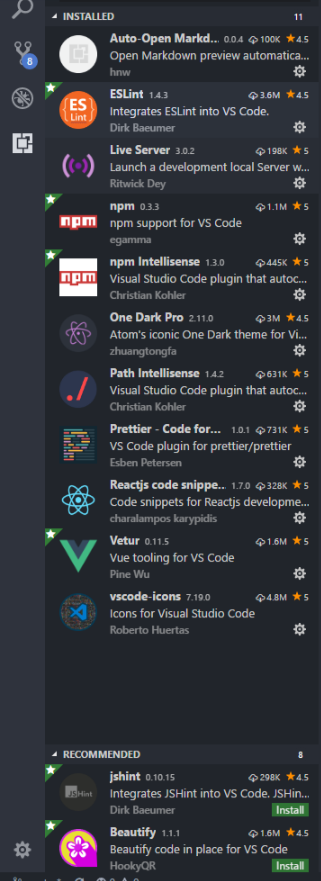

## keyboard shortcuts

```json
// 将键绑定放入此文件中以覆盖默认值
[
  {
    "key": "ctrl+d",
    "command": "editor.action.deleteLines",
    "when": "editorTextFocus && !editorReadonly"
  },
  {
    "key": "ctrl+shift+k",
    "command": "-editor.action.deleteLines",
    "when": "editorTextFocus && !editorReadonly"
  },
  {
    "key": "ctrl+alt+down",
    "command": "editor.action.copyLinesDownAction",
    "when": "editorTextFocus && !editorReadonly"
  },
  {
    "key": "shift+alt+down",
    "command": "-editor.action.copyLinesDownAction",
    "when": "editorTextFocus && !editorReadonly"
  },
  {
    "key": "alt+/",
    "command": "editor.action.quickFix",
    "when": "editorHasCodeActionsProvider && editorTextFocus && !editorReadonly"
  },
  {
    "key": "ctrl+1",
    "command": "-editor.action.quickFix",
    "when": "editorHasCodeActionsProvider && editorTextFocus && !editorReadonly"
  },
  {
    "key": "ctrl+shift+h",
    "command": "workbench.action.findInFiles",
    "when": "!searchInputBoxFocus"
  },
  {
    "key": "ctrl+shift+f",
    "command": "-workbench.action.findInFiles",
    "when": "!searchInputBoxFocus"
  },
  {
    "key": "ctrl+alt+f",
    "command": "workbench.view.search",
    "when": "!searchViewletVisible"
  },
  {
    "key": "ctrl+shift+f",
    "command": "-workbench.view.search",
    "when": "!searchViewletVisible"
  },
  {
    "key": "ctrl+shift+alt+f",
    "command": "search.action.focusActiveEditor",
    "when": "searchInputBoxFocus && searchViewletVisible"
  },
  {
    "key": "ctrl+shift+f",
    "command": "-search.action.focusActiveEditor",
    "when": "searchInputBoxFocus && searchViewletVisible"
  },
  {
    "key": "ctrl+f",
    "command": "actions.find",
    "when": "editorTextFocus && !editorReadonly"
  },
  {
    "key": "ctrl+f",
    "command": "-actions.find",
    "when": "editorTextFocus && !editorReadonly"
  },
  {
    "key": "ctrl+shift+f",
    "command": "editor.action.formatDocument",
    "when":
      "editorHasDocumentFormattingProvider && editorTextFocus && !editorReadonly"
  },
  {
    "key": "shift+alt+f",
    "command": "-editor.action.formatDocument",
    "when":
      "editorHasDocumentFormattingProvider && editorTextFocus && !editorReadonly"
  },
  {
    "key": "ctrl+shift+x",
    "command": "editor.action.transformToUppercase",
    "when": "editorTextFocus && !editorReadonly"
  },
  {
    "key": "ctrl+shift+y",
    "command": "editor.action.transformToLowercase",
    "when": "editorTextFocus && !editorReadonly"
  },
  {
    "key": "ctrl+alt+n",
    "command": "workbench.action.quickOpenTerm"
  }
]
```

# User Settings

```json
{
  "window.zoomLevel": 0,
  "window.menuBarVisibility": "toggle",
  "workbench.startupEditor": "newUntitledFile",
  "workbench.colorTheme": "One Dark Pro",
  "workbench.iconTheme": "vscode-icons",
  "explorer.confirmDragAndDrop": false,
  "explorer.confirmDelete": false,
  "git.confirmSync": false,
  "git.path": "D:\\Develop\\Git\\cmd\\git.exe",
  "typescript.npm": "D:\\Develop\\NodeJS",
  "editor.tabSize": 2,
  "editor.autoIndent": true,
  "editor.acceptSuggestionOnEnter": "smart",
  "editor.renderWhitespace": "all",
  "editor.quickSuggestions": {
    "other": true,
    "comments": false,
    "strings": true
  },
  "vetur.format.defaultFormatter.html": "js-beautify-html",
  "prettier.eslintIntegration": true,
  "prettier.singleQuote": true,
  "prettier.semi": false
}
```
# Plugins
  
